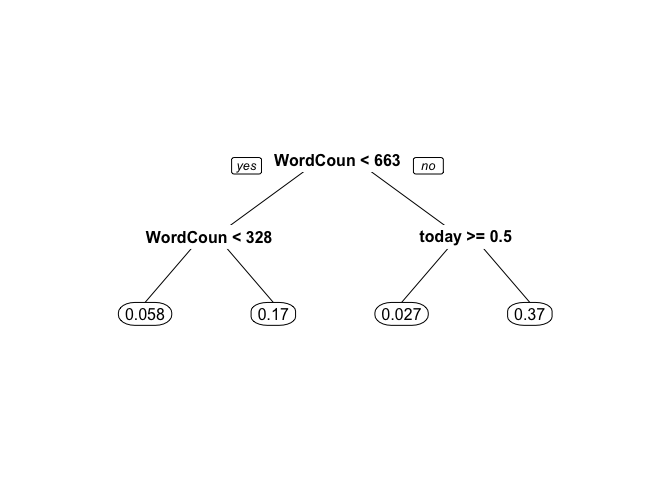
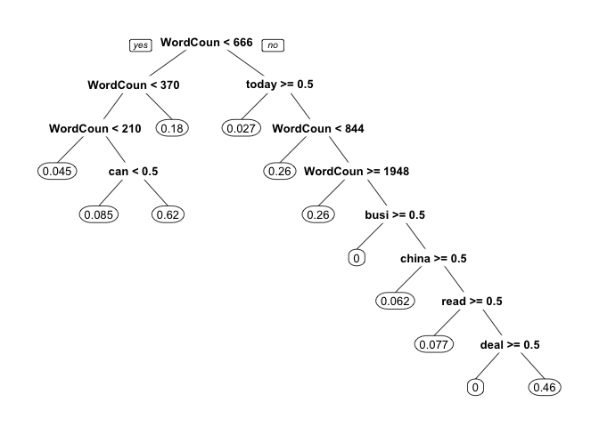
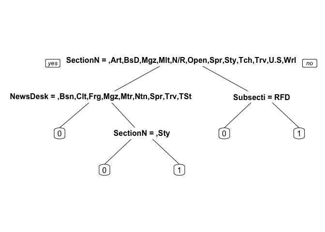
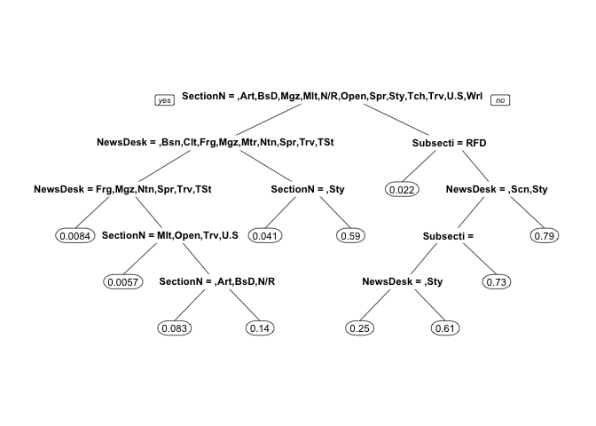

# The Analytics Edge - Kaggle Competition 2015
Jose A. Dianes  
13 April 2015  

# Task description  

# Data loading and preparation  


```r
library(tm)
library(ROCR)
library(rpart)
library(rpart.plot)
library(caTools)
library(randomForest)
library(caret)
library(e1071)
```

Let's start by reading the train and test data into the corresponding data frames.  


```r
newsTrain <- read.csv("data/NYTimesBlogTrain.csv", stringsAsFactors=FALSE)
newsTest <- read.csv("data/NYTimesBlogTest.csv", stringsAsFactors=FALSE)
summary(newsTrain)
```

```
##    NewsDesk         SectionName        SubsectionName    
##  Length:6532        Length:6532        Length:6532       
##  Class :character   Class :character   Class :character  
##  Mode  :character   Mode  :character   Mode  :character  
##                                                          
##                                                          
##                                                          
##    Headline           Snippet            Abstract        
##  Length:6532        Length:6532        Length:6532       
##  Class :character   Class :character   Class :character  
##  Mode  :character   Mode  :character   Mode  :character  
##                                                          
##                                                          
##                                                          
##    WordCount         PubDate             Popular          UniqueID   
##  Min.   :    0.0   Length:6532        Min.   :0.0000   Min.   :   1  
##  1st Qu.:  187.0   Class :character   1st Qu.:0.0000   1st Qu.:1634  
##  Median :  374.0   Mode  :character   Median :0.0000   Median :3266  
##  Mean   :  524.4                      Mean   :0.1673   Mean   :3266  
##  3rd Qu.:  723.2                      3rd Qu.:0.0000   3rd Qu.:4899  
##  Max.   :10912.0                      Max.   :1.0000   Max.   :6532
```

From the summary we can see that we have several fields we could use to train
our models.  

# A simple bag-of-words model  

As a first approach, we will use bag-of-words models for teh headline text.  

## Preparing the corpus  

In order to build the corpus, we will go through the usual `tm` package calls.  


```r
corpusHeadline <- Corpus(VectorSource(c(newsTrain$Headline, newsTest$Headline)))
corpusHeadline <- tm_map(corpusHeadline, tolower)
corpusHeadline <- tm_map(corpusHeadline, PlainTextDocument)
corpusHeadline <- tm_map(corpusHeadline, removePunctuation)
corpusHeadline <- tm_map(corpusHeadline, removeWords, stopwords("english"))
corpusHeadline <- tm_map(corpusHeadline, stemDocument)
```

Now we are ready to convert our corpus to a DocumentTermMatrix, remove sparse 
terms, and turn it into a data frame. We selected one particular threshold to 
remove sparse terms. Later on we must try different ones.  


```r
dtm <- DocumentTermMatrix(corpusHeadline)
sparse <- removeSparseTerms(dtm, 0.99)
headlineWords <- as.data.frame(as.matrix(sparse))
```

Let's make sure our variable names are okay for R.  


```r
colnames(headlineWords) <- make.names(colnames(headlineWords))
```

## Training the models  

First we need to split the observations back into the training set and testing 
set. To do this, we can use the `head` and `tail` functions in `R`.  


```r
headlineWordsTrain <- head(headlineWords, nrow(newsTrain))
headlineWordsTest <- tail(headlineWords, nrow(newsTest))
```

Note that this split of HeadlineWords works to properly put the observations 
back into the training and testing sets, because of how we combined them 
together when we first made our corpus.  

Before building models, we want to add back the original variables from our
datasets. We'll add back the dependent variable to the training set, and the
`WordCount` variable to both datasets. Later on we will experiment with adding
more variables to use in our model.  


```r
headlineWordsTrain$Popular <- newsTrain$Popular
headlineWordsTrain$WordCount <- newsTrain$WordCount
headlineWordsTest$WordCount <- newsTest$WordCount
```

### Logistic regression  

Now let's create a logistic regression model using all of the variables.  


```r
headlineWordsLog <- glm(Popular ~ ., data=headlineWordsTrain, family=binomial)
```

```
## Warning: glm.fit: fitted probabilities numerically 0 or 1 occurred
```

And make predictions on our test set.  


```r
headlineWordsLogPredTest <- predict(headlineWordsLog, newdata=headlineWordsTest, type="response")
```

#### Evaluation  

In order to calculate the `AUC` we need the test data to be labeled with the final
response. But we don't have those labels. Actually we cannot evaluate any model
without those labels on the test data. In order to have some feedback from our
models performance we will split our training data into train and test and 
retrain/test the models using this new split.  


```r
spl <- sample.split(headlineWordsTrain$Popular, .7)
evalHeadlineWordsTrain <- subset(headlineWordsTrain, spl==T)
evalHeadlineWordsTest <- subset(headlineWordsTrain, spl==F)
```

Train the model.  


```r
evalHeadlineLogModel <- glm(Popular~., data=evalHeadlineWordsTrain, family=binomial)
```

```
## Warning: glm.fit: fitted probabilities numerically 0 or 1 occurred
```

Make predictions.  


```r
evalHeadlineLogPred <- predict(evalHeadlineLogModel, 
                               newdata=evalHeadlineWordsTest, type="response")
```

Get the `AUC` value.  


```r
headlineWordsLogROCR <- prediction(evalHeadlineLogPred, evalHeadlineWordsTest$Popular)
headlineWordsLogAUC <- as.numeric(performance(headlineWordsLogROCR, "auc")@y.values)
headlineWordsLogAUC
```

```
## [1] 0.7758371
```

We obtain an `AUC` value slightly higher than that we get when submitting data
to Kaggle. We need to keep this in mind. But remember, *when making submissions
we will always use the complete training data to train our models and generate
the submission file*.  

#### Generating submission file  

Now we can prepare our submission file for Kaggle.  


```r
mySubmission = data.frame(UniqueID = newsTest$UniqueID, Probability1 = headlineWordsLogPredTest)
write.csv(mySubmission, "SubmissionHeadlineLog.csv", row.names=FALSE)
```

### CART  

As an alternative that will also give us some insight into the nature of the 
data, we will build now classification trees. The corpus and training/test
data are the same. We just need to train a different type model.  


```r
headlineWordsCARTModel <- rpart(Popular~., data=evalHeadlineWordsTrain, method="class")
prp(headlineWordsCARTModel)
```

 

Not a very effective model. Let us get just probabilities in order to see what
is happening.  


```r
headlineWordsCARTModel <- rpart(Popular~., data=evalHeadlineWordsTrain)
prp(headlineWordsCARTModel)
```

 

We see the problem. Probabilities are actually too small (lower than .5) so
the tree never predicts an article as popular using that threshold.  

Let's try now to make the tree more complex.  


```r
headlineWordsCARTModel <- rpart(Popular~., data=evalHeadlineWordsTrain, cp=0.0025)
prp(headlineWordsCARTModel)
```

 

Let's obtain predictions using this last model.  


```r
headlineWordsCARTPred <- predict(headlineWordsCARTModel, newdata=evalHeadlineWordsTest)
```

And let's evaluate this last model.  


```r
headlineWordsCARTROCR <- prediction(headlineWordsCARTPred, 
                                   evalHeadlineWordsTest$Popular)
headlineWordsCARTauc <- as.numeric(performance(headlineWordsCARTROCR, "auc")@y.values)
headlineWordsCARTauc
```

```
## [1] 0.7216746
```

It doesn't improve the logistic regression model.  

### Random forest  

As a third method, we will try random forests.  


```r
healineWordsRF <- randomForest(Popular~., data=evalHeadlineWordsTrain)
```

```
## Warning in randomForest.default(m, y, ...): The response has five or fewer
## unique values.  Are you sure you want to do regression?
```

Make predictions.  


```r
headlineWordsRFPred <- predict(healineWordsRF, newdata=evalHeadlineWordsTest)
```

Right into `auc` calculation.  


```r
headlineWordsRFrocr <- prediction(headlineWordsRFPred, evalHeadlineWordsTest$Popular)
headlineWordsRFauc <- as.numeric(performance(headlineWordsRFrocr, "auc")@y.values)
headlineWordsRFauc
```

```
## [1] 0.7554633
```

#### Generating submission file  

This is the best model so far. Let's build it using the complete training set.  


```r
healineWordsRF <- randomForest(Popular~., data=headlineWordsTrain)
```

```
## Warning in randomForest.default(m, y, ...): The response has five or fewer
## unique values.  Are you sure you want to do regression?
```

Make predictions.  


```r
headlineWordsRFPred <- predict(healineWordsRF, newdata=headlineWordsTest, type="response")
```

Now we can prepare our submission file for Kaggle.  


```r
mySubmission <- data.frame(
    UniqueID = newsTest$UniqueID, 
    Probability1 = abs(headlineWordsRFPred)
    )
write.csv(mySubmission, "SubmissionHeadlineRF.csv", row.names=FALSE)
```


# A richer model  

So far our model just used the term matrix and word counts. This is clearly
insuficient. Which of the other variables in the original dataset can make a
a difference? Actually we could classify those variables into:  

* Metadata variables, including `NewsDesk`, `SectionName`, `SubsectionName`,
`PubDate`.  
* Text variables, including `Headline`, `Snippet`, `Abstract`.  

In order to find out the first ones, we will build models using just them and
not data. In order to find out the text variables, we will create different 
corpora and repreat the initial approach. Finally we will combine them.  

## Logistic regression on metadata  

Let's build a new dataset including just the three factor variables and the date.  


```r
newsTrainMeta <- data.frame(
    Popular=newsTrain$Popular,
    NewsDesk = as.factor(newsTrain$NewsDesk),
    SectionName = as.factor(newsTrain$SectionName),
    SubsectionName = as.factor(newsTrain$SubsectionName)
    )
newsTestMeta <- data.frame(
    NewsDesk = factor(newsTest$NewsDesk, levels=levels(newsTrainMeta$NewsDesk)),
    SectionName = factor(newsTest$SectionName, levels=levels(newsTrainMeta$SectionName)),
    SubsectionName = factor(newsTest$SubsectionName, levels=levels(newsTrainMeta$Subsection))
    )
```

Now we build a linear model using all the variables.  


```r
metaLogModel <- glm(Popular~., data=newsTrainMeta, family=binomial)
summary(metaLogModel)
```

```
## 
## Call:
## glm(formula = Popular ~ ., family = binomial, data = newsTrainMeta)
## 
## Deviance Residuals: 
##      Min        1Q    Median        3Q       Max  
## -2.08071  -0.43275  -0.39233  -0.00013   3.08337  
## 
## Coefficients: (4 not defined because of singularities)
##                                   Estimate Std. Error z value Pr(>|z|)    
## (Intercept)                     -2.321e+00  9.757e-02 -23.791  < 2e-16 ***
## NewsDeskBusiness                 1.515e+00  8.739e-01   1.734  0.08298 .  
## NewsDeskCulture                 -1.624e+01  6.523e+03  -0.002  0.99801    
## NewsDeskForeign                 -1.624e+01  5.109e+02  -0.032  0.97463    
## NewsDeskMagazine                -1.624e+01  1.172e+03  -0.014  0.98894    
## NewsDeskMetro                   -4.412e-02  2.718e-01  -0.162  0.87105    
## NewsDeskNational                -1.624e+01  4.612e+03  -0.004  0.99719    
## NewsDeskOpEd                     3.118e+00  1.115e+00   2.796  0.00518 ** 
## NewsDeskScience                  2.586e+00  1.283e+00   2.015  0.04394 *  
## NewsDeskSports                  -1.624e+01  6.523e+03  -0.002  0.99801    
## NewsDeskStyles                  -1.802e+00  7.210e-01  -2.499  0.01246 *  
## NewsDeskTravel                   1.382e+01  6.523e+03   0.002  0.99831    
## NewsDeskTStyle                  -2.054e+00  3.493e-01  -5.880 4.11e-09 ***
## SectionNameArts                  1.604e+01  6.523e+03   0.002  0.99804    
## SectionNameBusiness Day         -2.484e+00  9.812e-01  -2.532  0.01136 *  
## SectionNameCrosswords/Games      2.463e+00  8.919e-01   2.762  0.00575 ** 
## SectionNameHealth                2.433e-01  1.286e+00   0.189  0.84994    
## SectionNameMagazine                     NA         NA      NA       NA    
## SectionNameMultimedia           -1.920e+00  7.188e-01  -2.671  0.00756 ** 
## SectionNameN.Y. / Region                NA         NA      NA       NA    
## SectionNameOpen                 -1.624e+01  3.261e+03  -0.005  0.99603    
## SectionNameOpinion               4.880e-01  1.115e+00   0.438  0.66157    
## SectionNameSports                3.997e-10  9.224e+03   0.000  1.00000    
## SectionNameStyle                -1.444e+01  4.612e+03  -0.003  0.99750    
## SectionNameTechnology           -9.167e-01  8.840e-01  -1.037  0.29974    
## SectionNameTravel               -1.624e+01  6.523e+03  -0.002  0.99801    
## SectionNameU.S.                  4.364e+00  7.293e-01   5.984 2.18e-09 ***
## SectionNameWorld                -8.300e-07  2.233e+03   0.000  1.00000    
## SubsectionNameAsia Pacific       1.437e+01  2.174e+03   0.007  0.99473    
## SubsectionNameDealbook           1.006e+00  4.690e-01   2.145  0.03198 *  
## SubsectionNameEducation         -2.061e+01  3.618e+02  -0.057  0.95458    
## SubsectionNameFashion & Style           NA         NA      NA       NA    
## SubsectionNamePolitics          -4.364e+00  6.523e+03  -0.001  0.99947    
## SubsectionNameRoom For Debate   -2.278e+00  1.502e+00  -1.517  0.12930    
## SubsectionNameSmall Business            NA         NA      NA       NA    
## SubsectionNameThe Public Editor  3.219e+00  1.245e+00   2.585  0.00973 ** 
## ---
## Signif. codes:  0 '***' 0.001 '**' 0.01 '*' 0.05 '.' 0.1 ' ' 1
## 
## (Dispersion parameter for binomial family taken to be 1)
## 
##     Null deviance: 5900.1  on 6531  degrees of freedom
## Residual deviance: 3531.3  on 6500  degrees of freedom
## AIC: 3595.3
## 
## Number of Fisher Scoring iterations: 17
```

We see that some factor levels are meaningful, but not all of them. This might
be a good use case for classification trees and random forests.  

In order to evaluate our models, let's use the same split approach we used in
the bag of words section.  


```r
spl <- sample.split(newsTrainMeta$Popular, .75)
evalNewsTrain <- subset(newsTrainMeta, spl==T)
evalNewsTest <- subset(newsTrainMeta, spl==F)
```

Build again the model.  


```r
metaLogModel <- glm(Popular~., data=evalNewsTrain, family=binomial)
summary(metaLogModel)
```

```
## 
## Call:
## glm(formula = Popular ~ ., family = binomial, data = evalNewsTrain)
## 
## Deviance Residuals: 
##     Min       1Q   Median       3Q      Max  
## -2.0035  -0.4213  -0.3443  -0.1123   3.1840  
## 
## Coefficients: (5 not defined because of singularities)
##                                   Estimate Std. Error z value Pr(>|z|)    
## (Intercept)                     -2.377e+00  1.165e-01 -20.404  < 2e-16 ***
## NewsDeskBusiness                 1.810e+00  9.283e-01   1.950  0.05115 .  
## NewsDeskCulture                 -1.619e+01  6.523e+03  -0.002  0.99802    
## NewsDeskForeign                 -1.619e+01  6.030e+02  -0.027  0.97858    
## NewsDeskMagazine                -1.619e+01  1.279e+03  -0.013  0.98990    
## NewsDeskMetro                   -4.184e-01  3.824e-01  -1.094  0.27391    
## NewsDeskNational                -1.619e+01  6.523e+03  -0.002  0.99802    
## NewsDeskOpEd                     3.142e+00  1.118e+00   2.810  0.00495 ** 
## NewsDeskScience                  2.631e+00  1.288e+00   2.042  0.04112 *  
## NewsDeskSports                  -1.619e+01  6.523e+03  -0.002  0.99802    
## NewsDeskStyles                  -1.525e+00  7.256e-01  -2.101  0.03562 *  
## NewsDeskTravel                   1.409e+01  6.523e+03   0.002  0.99828    
## NewsDeskTStyle                  -2.126e+00  4.267e-01  -4.982 6.28e-07 ***
## SectionNameArts                  1.615e+01  6.523e+03   0.002  0.99802    
## SectionNameBusiness Day         -2.749e+00  1.054e+00  -2.608  0.00910 ** 
## SectionNameCrosswords/Games      2.144e+00  9.466e-01   2.265  0.02354 *  
## SectionNameHealth                2.000e-01  1.291e+00   0.155  0.87688    
## SectionNameMagazine                     NA         NA      NA       NA    
## SectionNameMultimedia           -1.666e+00  7.227e-01  -2.305  0.02119 *  
## SectionNameN.Y. / Region                NA         NA      NA       NA    
## SectionNameOpen                 -1.619e+01  3.766e+03  -0.004  0.99657    
## SectionNameOpinion               5.323e-01  1.118e+00   0.476  0.63385    
## SectionNameSports                       NA         NA      NA       NA    
## SectionNameStyle                -1.466e+01  6.523e+03  -0.002  0.99821    
## SectionNameTechnology           -1.277e+00  9.424e-01  -1.355  0.17528    
## SectionNameTravel               -1.619e+01  6.523e+03  -0.002  0.99802    
## SectionNameU.S.                  4.240e+00  7.369e-01   5.754 8.71e-09 ***
## SectionNameWorld                -1.998e-07  2.384e+03   0.000  1.00000    
## SubsectionNameAsia Pacific       1.350e+01  2.306e+03   0.006  0.99533    
## SubsectionNameDealbook           1.052e+00  5.252e-01   2.003  0.04521 *  
## SubsectionNameEducation         -2.043e+01  4.301e+02  -0.047  0.96212    
## SubsectionNameFashion & Style           NA         NA      NA       NA    
## SubsectionNamePolitics          -4.240e+00  7.989e+03  -0.001  0.99958    
## SubsectionNameRoom For Debate   -1.939e+00  1.505e+00  -1.288  0.19764    
## SubsectionNameSmall Business            NA         NA      NA       NA    
## SubsectionNameThe Public Editor  2.857e+00  1.258e+00   2.270  0.02321 *  
## ---
## Signif. codes:  0 '***' 0.001 '**' 0.01 '*' 0.05 '.' 0.1 ' ' 1
## 
## (Dispersion parameter for binomial family taken to be 1)
## 
##     Null deviance: 4425.8  on 4898  degrees of freedom
## Residual deviance: 2612.2  on 4868  degrees of freedom
## AIC: 2674.2
## 
## Number of Fisher Scoring iterations: 17
```

Make predictions using the linear model.  


```r
metaLogPred <- predict(metaLogModel, newdata=evalNewsTest, type="response")
```

```
## Warning in predict.lm(object, newdata, se.fit, scale = 1, type =
## ifelse(type == : prediction from a rank-deficient fit may be misleading
```

Get the `auc` value.  


```r
metaLogRocr <- prediction(metaLogPred, evalNewsTest$Popular)
metaLogAuc <- as.numeric(performance(metaLogRocr, "auc")@y.values)
metaLogAuc
```

```
## [1] 0.8658573
```

We get an `auc` value of 0.8658573. The metadata by itself improves the 
text based model. This makes sense since most people have preference for specific
subjects and this makes them more popular.  

## Threes and Random Forests on metadata  

Randome forests are usually a good approach to classify non linear datasets like
the one we have based on metadata. But fist let's us try with a plain tree so we
can better understand what makes an article popular.  


```r
metaCartModel <- rpart(Popular~., data=evalNewsTrain, method="class")
prp(metaCartModel)
```

 

The three is clearly to coarse. It classifies popular articles as being just
part of a very specific grup of sections. Let's try with increasing the three
complexity, and also showing probabilities that are more expressive.  


```r
metaCartModel <- rpart(Popular~., data=evalNewsTrain, cp=.0005)
prp(metaCartModel)
```

 

Well, we have there a bunch of combinations of metadata that makes an article
popular these days.  

But let's evaluate this model using the `auc` value.  


```r
metaCartPred <- predict(metaCartModel, newdata=evalNewsTest)
metaCartRocr <- prediction(metaCartPred, evalNewsTest$Popular)
metaCartAuc <- as.numeric(performance(metaCartRocr, "auc")@y.values)
metaCartAuc
```

```
## [1] 0.8642197
```

Not bad! We could try using cross-validation to find the right cp value.  


Define cross-validation experiment.  


```r
numFolds <- trainControl( method = "cv", number = 10 )
cpGrid <- expand.grid( .cp = seq(0.01,0.5,0.01)) 
```

Perform the cross validation.  


```r
tt <- train(Popular ~ ., data = evalNewsTrain, method = "rpart", trControl = numFolds, tuneGrid = cpGrid )
```

```
## Warning in nominalTrainWorkflow(x = x, y = y, wts = weights, info =
## trainInfo, : There were missing values in resampled performance measures.
```

```r
tt
```

```
## CART 
## 
## 4899 samples
##    3 predictor
## 
## No pre-processing
## Resampling: Cross-Validated (10 fold) 
## 
## Summary of sample sizes: 4409, 4409, 4410, 4409, 4409, 4409, ... 
## 
## Resampling results across tuning parameters:
## 
##   cp    RMSE       Rsquared   RMSE SD     Rsquared SD
##   0.01  0.2831635  0.4241320  0.01583655  0.04385342 
##   0.02  0.2831574  0.4241485  0.01566570  0.04462146 
##   0.03  0.2952019  0.3745502  0.01449965  0.04382456 
##   0.04  0.2952019  0.3745502  0.01449965  0.04382456 
##   0.05  0.2952019  0.3745502  0.01449965  0.04382456 
##   0.06  0.3074960  0.3210840  0.01455676  0.04062383 
##   0.07  0.3114532  0.3028461  0.01426451  0.06263444 
##   0.08  0.3246222  0.2441320  0.01296630  0.04662638 
##   0.09  0.3246222  0.2441320  0.01296630  0.04662638 
##   0.10  0.3246222  0.2441320  0.01296630  0.04662638 
##   0.11  0.3246222  0.2441320  0.01296630  0.04662638 
##   0.12  0.3246222  0.2441320  0.01296630  0.04662638 
##   0.13  0.3246222  0.2441320  0.01296630  0.04662638 
##   0.14  0.3246222  0.2441320  0.01296630  0.04662638 
##   0.15  0.3246222  0.2441320  0.01296630  0.04662638 
##   0.16  0.3246222  0.2441320  0.01296630  0.04662638 
##   0.17  0.3246222  0.2441320  0.01296630  0.04662638 
##   0.18  0.3246222  0.2441320  0.01296630  0.04662638 
##   0.19  0.3246222  0.2441320  0.01296630  0.04662638 
##   0.20  0.3246222  0.2441320  0.01296630  0.04662638 
##   0.21  0.3246222  0.2441320  0.01296630  0.04662638 
##   0.22  0.3246222  0.2441320  0.01296630  0.04662638 
##   0.23  0.3246222  0.2441320  0.01296630  0.04662638 
##   0.24  0.3424667  0.2217189  0.02330138  0.03582517 
##   0.25  0.3705444  0.1517468  0.01904961          NA 
##   0.26  0.3731667        NaN  0.01326350          NA 
##   0.27  0.3731667        NaN  0.01326350          NA 
##   0.28  0.3731667        NaN  0.01326350          NA 
##   0.29  0.3731667        NaN  0.01326350          NA 
##   0.30  0.3731667        NaN  0.01326350          NA 
##   0.31  0.3731667        NaN  0.01326350          NA 
##   0.32  0.3731667        NaN  0.01326350          NA 
##   0.33  0.3731667        NaN  0.01326350          NA 
##   0.34  0.3731667        NaN  0.01326350          NA 
##   0.35  0.3731667        NaN  0.01326350          NA 
##   0.36  0.3731667        NaN  0.01326350          NA 
##   0.37  0.3731667        NaN  0.01326350          NA 
##   0.38  0.3731667        NaN  0.01326350          NA 
##   0.39  0.3731667        NaN  0.01326350          NA 
##   0.40  0.3731667        NaN  0.01326350          NA 
##   0.41  0.3731667        NaN  0.01326350          NA 
##   0.42  0.3731667        NaN  0.01326350          NA 
##   0.43  0.3731667        NaN  0.01326350          NA 
##   0.44  0.3731667        NaN  0.01326350          NA 
##   0.45  0.3731667        NaN  0.01326350          NA 
##   0.46  0.3731667        NaN  0.01326350          NA 
##   0.47  0.3731667        NaN  0.01326350          NA 
##   0.48  0.3731667        NaN  0.01326350          NA 
##   0.49  0.3731667        NaN  0.01326350          NA 
##   0.50  0.3731667        NaN  0.01326350          NA 
## 
## RMSE was used to select the optimal model using  the smallest value.
## The final value used for the model was cp = 0.02.
```

Create a new CART model, predict, and evaluate.  


```r
metaCartCvModel <- rpart(Popular ~ ., data = evalNewsTrain, cp = 0.02)
metaCartCvPred <- predict(metaCartCvModel, newdata = evalNewsTest)
metaCartCvRocr <- prediction(metaCartCvPred, evalNewsTest$Popular)
metaCartCvAuc <- as.numeric(performance(metaCartCvRocr, "auc")@y.values)
metaCartCvAuc
```

```
## [1] 0.8074728
```

We obtain an `auc` value for the bext `cp` of 0.8074728.  

Now with the random forest.  


```r
metaRfModel <- randomForest(Popular~., data=evalNewsTrain)
```

```
## Warning in randomForest.default(m, y, ...): The response has five or fewer
## unique values.  Are you sure you want to do regression?
```

Do predictions.  


```r
metaRfPred <- predict(metaRfModel, newdata=evalNewsTest)
```

And the `auc` value.  


```r
metaRfRocr <- prediction(metaRfPred, evalNewsTest$Popular)
metaRfAuc <- as.numeric(performance(metaRfRocr, "auc")@y.values)
metaRfAuc
```

```
## [1] 0.8519056
```

## Adding text to metadata  

Can we improve the accuracy of the metadata-based models by using our bag-of-words
and word count information? Let's start by creating a new dataframe with both
sources.  


```r
newsTrainMetaText <- cbind( newsTrainMeta, headlineWordsTrain)
newsTrainMetaText$Popular <- NULL # remove one of the Popular columns since they are replicated
```

Now we need to create again our train splits.  


```r
evalNewsMetaTextTrain <- subset(newsTrainMetaText, spl==T)
evalNewsMetaTextTest <- subset(newsTrainMetaText, spl==F)
```

### Logistic Regression  

Now we build the logistic regression model.  


```r
metaTextLogModel <- glm(Popular~., data=evalNewsMetaTextTrain, family=binomial)
```

```
## Warning: glm.fit: fitted probabilities numerically 0 or 1 occurred
```

```r
summary(metaTextLogModel)
```

```
## 
## Call:
## glm(formula = Popular ~ ., family = binomial, data = evalNewsMetaTextTrain)
## 
## Deviance Residuals: 
##     Min       1Q   Median       3Q      Max  
## -3.3254  -0.3674  -0.1893  -0.0001   3.5286  
## 
## Coefficients: (5 not defined because of singularities)
##                                   Estimate Std. Error z value Pr(>|z|)    
## (Intercept)                     -3.096e+00  1.620e-01 -19.114  < 2e-16 ***
## NewsDeskBusiness                 1.730e+00  9.718e-01   1.780 0.075023 .  
## NewsDeskCulture                 -1.683e+01  1.075e+04  -0.002 0.998751    
## NewsDeskForeign                 -1.665e+01  9.706e+02  -0.017 0.986316    
## NewsDeskMagazine                -1.758e+01  2.023e+03  -0.009 0.993067    
## NewsDeskMetro                    1.207e-01  4.356e-01   0.277 0.781720    
## NewsDeskNational                -1.722e+01  1.075e+04  -0.002 0.998722    
## NewsDeskOpEd                     3.231e+00  1.108e+00   2.916 0.003545 ** 
## NewsDeskScience                  2.731e+00  1.290e+00   2.117 0.034286 *  
## NewsDeskSports                  -1.891e+01  1.075e+04  -0.002 0.998597    
## NewsDeskStyles                  -1.402e+00  8.060e-01  -1.740 0.081929 .  
## NewsDeskTravel                   1.489e+01  1.075e+04   0.001 0.998895    
## NewsDeskTStyle                  -2.809e+00  5.186e-01  -5.415 6.12e-08 ***
## SectionNameArts                  1.674e+01  1.075e+04   0.002 0.998758    
## SectionNameBusiness Day         -2.492e+00  1.099e+00  -2.268 0.023326 *  
## SectionNameCrosswords/Games      1.979e+00  9.883e-01   2.002 0.045274 *  
## SectionNameHealth               -2.226e-01  1.293e+00  -0.172 0.863309    
## SectionNameMagazine                     NA         NA      NA       NA    
## SectionNameMultimedia           -1.767e+00  7.390e-01  -2.391 0.016823 *  
## SectionNameN.Y. / Region                NA         NA      NA       NA    
## SectionNameOpen                 -1.714e+01  6.102e+03  -0.003 0.997759    
## SectionNameOpinion               3.389e-01  1.107e+00   0.306 0.759417    
## SectionNameSports                       NA         NA      NA       NA    
## SectionNameStyle                -1.617e+01  1.075e+04  -0.002 0.998800    
## SectionNameTechnology           -1.179e+00  9.859e-01  -1.196 0.231742    
## SectionNameTravel               -1.664e+01  1.075e+04  -0.002 0.998765    
## SectionNameU.S.                  3.827e+00  8.175e-01   4.681 2.85e-06 ***
## SectionNameWorld                -1.501e+00  3.889e+03   0.000 0.999692    
## SubsectionNameAsia Pacific       1.494e+01  3.766e+03   0.004 0.996835    
## SubsectionNameDealbook           5.682e-01  5.499e-01   1.033 0.301466    
## SubsectionNameEducation         -2.173e+01  6.520e+02  -0.033 0.973414    
## SubsectionNameFashion & Style           NA         NA      NA       NA    
## SubsectionNamePolitics          -3.922e+00  1.317e+04   0.000 0.999762    
## SubsectionNameRoom For Debate   -5.349e+00  1.545e+00  -3.461 0.000538 ***
## SubsectionNameSmall Business            NA         NA      NA       NA    
## SubsectionNameThe Public Editor  2.420e+00  1.280e+00   1.890 0.058696 .  
## X2014                           -1.785e-01  7.405e-01  -0.241 0.809469    
## X2015                           -1.540e+01  2.088e+03  -0.007 0.994114    
## art                             -1.598e-02  7.383e-01  -0.022 0.982733    
## bank                             1.514e-01  3.894e-01   0.389 0.697450    
## big                              2.541e-02  4.517e-01   0.056 0.955144    
## billion                         -2.932e-01  5.879e-01  -0.499 0.618056    
## busi                            -1.781e+00  1.126e+00  -1.581 0.113899    
## can                              6.651e-01  3.985e-01   1.669 0.095176 .  
## china                           -4.608e-01  7.518e-01  -0.613 0.539893    
## daili                           -1.614e+01  9.565e+02  -0.017 0.986533    
## day                             -7.472e-01  5.973e-01  -1.251 0.210985    
## deal                            -4.232e-01  5.564e-01  -0.761 0.446895    
## ebola                           -2.775e-02  3.798e-01  -0.073 0.941755    
## fashion                         -1.464e-01  1.035e+00  -0.141 0.887504    
## first                           -2.382e+00  1.461e+00  -1.630 0.103060    
## get                              1.155e+00  4.343e-01   2.661 0.007798 ** 
## make                            -1.428e-01  4.577e-01  -0.312 0.754980    
## million                         -6.013e-01  7.457e-01  -0.806 0.420031    
## morn                            -3.209e+00  1.050e+00  -3.056 0.002240 ** 
## new                             -7.415e-01  3.589e-01  -2.066 0.038801 *  
## news                            -2.366e-01  9.586e-01  -0.247 0.805057    
## obama                            2.230e-02  4.346e-01   0.051 0.959080    
## pari                            -1.465e+01  1.086e+03  -0.013 0.989244    
## pictur                          -2.206e-01  1.085e+00  -0.203 0.838862    
## polit                           -4.220e-01  7.194e-01  -0.587 0.557437    
## rais                            -1.417e+00  1.063e+00  -1.333 0.182579    
## read                            -1.960e+00  6.501e-01  -3.016 0.002565 ** 
## report                          -6.783e-01  5.405e-01  -1.255 0.209524    
## say                             -3.616e-01  5.312e-01  -0.681 0.496083    
## senat                            2.217e-01  5.073e-01   0.437 0.662051    
## show                            -1.179e-01  5.232e-01  -0.225 0.821691    
## small                           -1.523e+01  1.083e+03  -0.014 0.988786    
## springsumm                       2.273e+00  2.343e+03   0.001 0.999226    
## take                            -4.690e-01  5.213e-01  -0.900 0.368255    
## test                             3.900e-01  5.637e-01   0.692 0.489009    
## time                             3.903e-01  4.480e-01   0.871 0.383634    
## today                           -2.488e+00  8.449e-01  -2.945 0.003230 ** 
## week                            -1.137e-01  5.569e-01  -0.204 0.838169    
## will                             3.366e-02  4.874e-01   0.069 0.944935    
## word                             1.839e+00  7.953e-01   2.312 0.020771 *  
## year                            -1.266e+00  7.370e-01  -1.718 0.085815 .  
## york                             8.355e-01  6.243e-01   1.338 0.180802    
## WordCount                        1.658e-03  1.292e-04  12.836  < 2e-16 ***
## ---
## Signif. codes:  0 '***' 0.001 '**' 0.01 '*' 0.05 '.' 0.1 ' ' 1
## 
## (Dispersion parameter for binomial family taken to be 1)
## 
##     Null deviance: 4425.8  on 4898  degrees of freedom
## Residual deviance: 2268.7  on 4825  degrees of freedom
## AIC: 2416.7
## 
## Number of Fisher Scoring iterations: 18
```

Evaluate the model.  


```r
metaTextLogPred <- predict(metaTextLogModel, newdata=evalNewsMetaTextTest, type="response")
```

```
## Warning in predict.lm(object, newdata, se.fit, scale = 1, type =
## ifelse(type == : prediction from a rank-deficient fit may be misleading
```

```r
metaTextLogRocr <- prediction(metaTextLogPred, evalNewsMetaTextTest$Popular)
metaTextLogAuc <- as.numeric(performance(metaTextLogRocr, "auc")@y.values)
metaTextLogAuc
```

```
## [1] 0.9344578
```

That is a huge improvement but we should be careful because we had some warnings.  

### Classification Trees  

Let's try with the CART model. Again, we will find out the best `cp` value by
using corss-validation.  


```r
numFolds <- trainControl( method = "cv", number = 10 )
cpGrid <- expand.grid( .cp = seq(0.01,0.5,0.01)) 
tt <- train(Popular ~ ., data = evalNewsMetaTextTrain, method = "rpart", trControl = numFolds, tuneGrid = cpGrid )
```

```
## Warning in nominalTrainWorkflow(x = x, y = y, wts = weights, info =
## trainInfo, : There were missing values in resampled performance measures.
```

```r
tt
```

```
## CART 
## 
## 4899 samples
##   46 predictor
## 
## No pre-processing
## Resampling: Cross-Validated (10 fold) 
## 
## Summary of sample sizes: 4409, 4409, 4410, 4409, 4409, 4409, ... 
## 
## Resampling results across tuning parameters:
## 
##   cp    RMSE       Rsquared   RMSE SD     Rsquared SD
##   0.01  0.2808557  0.4338138  0.01359247  0.05799451 
##   0.02  0.2838645  0.4218212  0.01415395  0.05862995 
##   0.03  0.2855920  0.4150543  0.01318293  0.05340083 
##   0.04  0.2855920  0.4150543  0.01318293  0.05340083 
##   0.05  0.2999448  0.3552115  0.01192079  0.05615283 
##   0.06  0.2997260  0.3564806  0.01195861  0.05714499 
##   0.07  0.3118420  0.3032733  0.01369667  0.06051730 
##   0.08  0.3246086  0.2454334  0.01521509  0.06399911 
##   0.09  0.3246086  0.2454334  0.01521509  0.06399911 
##   0.10  0.3246086  0.2454334  0.01521509  0.06399911 
##   0.11  0.3246086  0.2454334  0.01521509  0.06399911 
##   0.12  0.3246086  0.2454334  0.01521509  0.06399911 
##   0.13  0.3246086  0.2454334  0.01521509  0.06399911 
##   0.14  0.3246086  0.2454334  0.01521509  0.06399911 
##   0.15  0.3246086  0.2454334  0.01521509  0.06399911 
##   0.16  0.3246086  0.2454334  0.01521509  0.06399911 
##   0.17  0.3246086  0.2454334  0.01521509  0.06399911 
##   0.18  0.3246086  0.2454334  0.01521509  0.06399911 
##   0.19  0.3246086  0.2454334  0.01521509  0.06399911 
##   0.20  0.3246086  0.2454334  0.01521509  0.06399911 
##   0.21  0.3246086  0.2454334  0.01521509  0.06399911 
##   0.22  0.3246086  0.2454334  0.01521509  0.06399911 
##   0.23  0.3246086  0.2454334  0.01521509  0.06399911 
##   0.24  0.3442848  0.2121320  0.02576965  0.04051097 
##   0.25  0.3671091  0.1633085  0.01856081  0.02647372 
##   0.26  0.3731989        NaN  0.01191296          NA 
##   0.27  0.3731989        NaN  0.01191296          NA 
##   0.28  0.3731989        NaN  0.01191296          NA 
##   0.29  0.3731989        NaN  0.01191296          NA 
##   0.30  0.3731989        NaN  0.01191296          NA 
##   0.31  0.3731989        NaN  0.01191296          NA 
##   0.32  0.3731989        NaN  0.01191296          NA 
##   0.33  0.3731989        NaN  0.01191296          NA 
##   0.34  0.3731989        NaN  0.01191296          NA 
##   0.35  0.3731989        NaN  0.01191296          NA 
##   0.36  0.3731989        NaN  0.01191296          NA 
##   0.37  0.3731989        NaN  0.01191296          NA 
##   0.38  0.3731989        NaN  0.01191296          NA 
##   0.39  0.3731989        NaN  0.01191296          NA 
##   0.40  0.3731989        NaN  0.01191296          NA 
##   0.41  0.3731989        NaN  0.01191296          NA 
##   0.42  0.3731989        NaN  0.01191296          NA 
##   0.43  0.3731989        NaN  0.01191296          NA 
##   0.44  0.3731989        NaN  0.01191296          NA 
##   0.45  0.3731989        NaN  0.01191296          NA 
##   0.46  0.3731989        NaN  0.01191296          NA 
##   0.47  0.3731989        NaN  0.01191296          NA 
##   0.48  0.3731989        NaN  0.01191296          NA 
##   0.49  0.3731989        NaN  0.01191296          NA 
##   0.50  0.3731989        NaN  0.01191296          NA 
## 
## RMSE was used to select the optimal model using  the smallest value.
## The final value used for the model was cp = 0.01.
```

This time we get `cp=0.01`. Let's build the model.  


```r
metaTextCartCvModel <- rpart(Popular~., data=evalNewsMetaTextTrain, cp=0.01)
metaTextCartCvPred <- predict(metaTextCartCvModel, newdata = evalNewsMetaTextTest)
metaTextCartCvRocr <- prediction(metaTextCartCvPred, evalNewsMetaTextTest$Popular)
metaTextCartCvAuc <- as.numeric(performance(metaTextCartCvRocr, "auc")@y.values)
metaTextCartCvAuc
```

```
## [1] 0.9009575
```

And finally random forests.  


```r
metaTextRfModel <- randomForest(Popular~., data=evalNewsMetaTextTrain)
```

```
## Warning in randomForest.default(m, y, ...): The response has five or fewer
## unique values.  Are you sure you want to do regression?
```

```r
metaTextRfPred <- predict(metaTextRfModel, newdata=evalNewsMetaTextTest)
metaTextRfRocr <- prediction(metaTextRfPred, evalNewsMetaTextTest$Popular)
metaTextRfAuc <- as.numeric(performance(metaTextRfRocr, "auc")@y.values)
metaTextRfAuc
```

```
## [1] 0.9373411
```

That is a really high `auc`. Let's save our results but first train the model
using the complete training set.  


```r
metaTextRfModel <- randomForest(Popular~., data=newsTrainMetaText)
```

```
## Warning in randomForest.default(m, y, ...): The response has five or fewer
## unique values.  Are you sure you want to do regression?
```

```r
newsTestMetaText <- cbind(newsTestMeta, headlineWordsTest)
metaTextRfPred <- predict(metaTextRfModel, newdata=newsTestMetaText)
mySubmission <- data.frame(
    UniqueID = newsTest$UniqueID, 
    Probability1 = abs(metaTextRfPred)
    )
write.csv(mySubmission, "SubmissionMetaTextRF.csv", row.names=FALSE)
```

### A look at difficult cases  

Let's check what is in those cases that our finest model (`metaTextRfModel`)
didn't classify properly. This will give us some clues about new predictors
or ways to approach the problem.  

# About dates  

Maybe an article date is not so important, but what about the day of the week
or the month of the year? Certain periods are more likely to have readers than 
others.  


# Cross-validation on Random Forests  


# TF-IDF  

By removing sparseness based just on counts we might be removing some important
words. A better approach is using TF-IDF.  

# Clustering    

- By clustering on the corpus and then table for Popular, we will extract
words that make an article popular?  
- Cluster then predict  


# Experiment: using separate models for each section and average them manually with different weights   

Rational behind this?  


